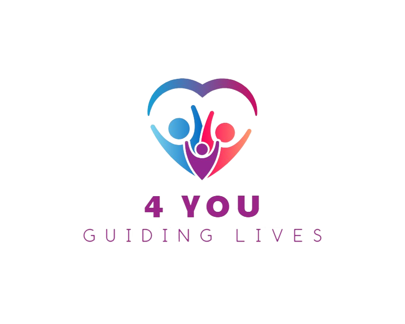

# 🌱 4You - Your Mental Health Companion

<div align="center">
  
  
  [](https://developer.android.com/)
  [](https://kotlinlang.org/)
  [](https://firebase.google.com/)
  [](https://material.io/)
  
  **A comprehensive mental health support app designed to help users track their emotional well-being, practice mindfulness, and build healthy habits.**
</div>

---

## 📱 About 4You

4You is a thoughtfully designed mental health application that empowers users to take control of their emotional well-being through daily mood tracking, reflective journaling, and guided wellness practices. Built with modern Android development practices and a focus on user experience, 4You provides a safe, supportive environment for mental health management.

### 🎯 **Why 4You Matters**

In today's fast-paced world, mental health awareness is more important than ever. 4You addresses the critical need for accessible, user-friendly mental health tools by providing:

- **📊 Daily Mood Tracking**: Visual mood logging with emoji-based interface
- **📝 Reflective Journaling**: Guided prompts for self-reflection and growth
- **🧘 Wellness Resources**: Breathing exercises and meditation guides
- **🆘 Crisis Support**: Quick access to emergency mental health resources
- **📈 Progress Tracking**: Visual insights into emotional patterns over time

### 🌟 **Key Features**

| Feature | Description | Benefit |
|---------|-------------|---------|
| **Mood Tracking** | 5-point emoji scale with daily logging | Helps users identify emotional patterns and triggers |
| **Daily Journaling** | Guided prompts with secure storage | Encourages self-reflection and emotional processing |
| **Breathing Exercises** | 4-4-4-4 guided breathing patterns | Provides immediate stress relief and relaxation |
| **Meditation Guide** | 5-minute mindfulness sessions | Builds meditation habits and mental clarity |
| **Crisis Support** | Emergency contact information | Ensures users have access to help when needed |
| **Dark Mode** | Automatic theme switching | Reduces eye strain and supports different user preferences |

---

## 🏗️ Technical Architecture

### **Architecture Overview**

4You follows a **Clean Architecture** pattern with clear separation of concerns, ensuring maintainability, testability, and scalability.

```
📁 app/src/main/java/com/example/a4you/
├── 📁 data/
│   ├── 📁 models/           # Data models and entities
│   │   ├── User.kt
│   │   ├── MoodEntry.kt
│   │   └── JournalEntry.kt
│   └── 📁 repository/       # Data access layer
│       ├── UserRepository.kt
│       ├── MoodRepository.kt
│       └── JournalRepository.kt
├── 📁 ui/
│   └── 📁 activities/        # UI layer - Activities
│       ├── MainActivity.kt
│       ├── LoginActivity.kt
│       ├── HomeActivity.kt
│       ├── MoodTrackingActivity.kt
│       ├── JournalingActivity.kt
│       ├── WellnessActivity.kt
│       ├── BreathingExerciseActivity.kt
│       └── MeditationActivity.kt
├── 📁 utils/                # Utility classes
│   ├── Constants.kt
│   ├── DateUtils.kt
│   └── ValidationUtils.kt
└── 📁 ui/theme/            # UI theming
    ├── Color.kt
    ├── Theme.kt
    └── Type.kt
```

### **Technology Stack**

#### **🛠️ Core Technologies**
- **Language**: Kotlin 100%
- **Platform**: Android (API 24+)
- **Architecture**: Clean Architecture + Repository Pattern
- **UI Framework**: XML Layouts with Material Design 3

#### **🔥 Backend & Database**
- **Authentication**: Firebase Authentication
- **Database**: Firebase Realtime Database
- **Google Sign-In**: Google Play Services Auth
- **Data Storage**: Cloud-based with offline capabilities

#### **🎨 UI/UX Technologies**
- **Design System**: Material Design 3
- **Layout**: ConstraintLayout + CardView
- **Theming**: Light/Dark mode support
- **Colors**: Mental health-focused color psychology
- **Typography**: Accessible font sizing and hierarchy

#### **⚡ Performance & Quality**
- **Async Operations**: Kotlin Coroutines
- **Memory Management**: Proper lifecycle handling
- **Error Handling**: Comprehensive Result types
- **Input Validation**: Client-side validation utilities
- **Accessibility**: Screen reader support and high contrast

---

## 🚀 Getting Started

### **Prerequisites**
- Android Studio Arctic Fox or later
- Android SDK 24+ (Android 7.0)
- Google Play Services
- Firebase project setup

### **Installation**

1. **Clone the repository**
   ```bash
   git clone https://github.com/yourusername/4you.git
   cd 4you
   ```

2. **Open in Android Studio**
   ```bash
   # Open Android Studio and select "Open an existing project"
   # Navigate to the 4you folder and select it
   ```

3. **Configure Firebase**
   - Create a new Firebase project at [Firebase Console](https://console.firebase.google.com/)
   - Enable Authentication and Realtime Database
   - Download `google-services.json` and place it in `app/` directory
   - Configure Google Sign-In in Firebase Console

4. **Build and Run**
   ```bash
   # Sync project with Gradle files
   # Build the project (Build > Make Project)
   # Run on device or emulator
   ```

---

## 🏛️ Architecture Deep Dive

### **Data Layer**

#### **Models**
```kotlin
// User data model with validation
data class User(
    val uid: String = "",
    val username: String = "",
    val email: String = "",
    val createdAt: Long = System.currentTimeMillis()
)

// Mood entry with timestamp and notes
data class MoodEntry(
    val mood: Int = 0, // 1-5 scale
    val date: String = "",
    val timestamp: Long = System.currentTimeMillis(),
    val notes: String = ""
)

// Journal entry with content and metadata
data class JournalEntry(
    val content: String = "",
    val date: String = "",
    val timestamp: Long = System.currentTimeMillis(),
    val mood: Int = 0,
    val tags: List<String> = emptyList()
)
```

#### **Repository Pattern**
The app uses the Repository pattern to abstract data access:

```kotlin
class MoodRepository {
    suspend fun saveMoodEntry(moodEntry: MoodEntry): Result<Unit>
    suspend fun getMoodEntries(userId: String, limit: Int = 30): Result<List<MoodEntry>>
}
```

**Benefits:**
- **Testability**: Easy to mock for unit testing
- **Flexibility**: Can switch data sources without changing UI
- **Separation**: Clear separation between data and business logic

### **UI Layer**

#### **Activity Structure**
Each activity follows a consistent pattern:

```kotlin
class MoodTrackingActivity : ComponentActivity() {
    private lateinit var moodRepository: MoodRepository
    
    override fun onCreate(savedInstanceState: Bundle?) {
        super.onCreate(savedInstanceState)
        setContentView(R.layout.activity_mood_tracking)
        
        setupUI()
        setupClickListeners()
    }
    
    private fun setupUI() { /* UI initialization */ }
    private fun setupClickListeners() { /* Event handling */ }
}
```

#### **Layout Architecture**
- **ScrollView**: Ensures content accessibility on all screen sizes
- **ConstraintLayout**: Efficient, flat view hierarchy
- **CardView**: Beautiful, elevated content containers
- **Material Design**: Consistent, accessible components

### **Utility Layer**

#### **Validation Utils**
```kotlin
object ValidationUtils {
    fun isValidEmail(email: String): Boolean
    fun isValidPassword(password: String): Boolean
    fun isValidMood(mood: Int): Boolean
    fun isValidJournalContent(content: String): Boolean
}
```

#### **Date Utils**
```kotlin
object DateUtils {
    fun getCurrentDate(): String
    fun getCurrentDisplayDate(): String
    fun formatDateForDisplay(date: String): String
}
```

---

## 🎨 Design System

### **Color Psychology**

The app uses carefully selected colors based on psychological research:

| Color | Hex | Usage | Psychological Effect |
|-------|-----|-------|---------------------|
| **Primary Blue** | `#4A90E2` | Main actions, trust | Calm, stability, trust |
| **Secondary Green** | `#7ED321` | Wellness, growth | Growth, healing, nature |
| **Accent Purple** | `#9013FE` | Mindfulness, spirituality | Spirituality, creativity |
| **Calm Blue** | `#E3F2FD` | Backgrounds | Reduced anxiety, comfort |
| **Mood Colors** | Various | Mood tracking | Intuitive emotional coding |

### **Typography Hierarchy**

```xml
<!-- Headers -->
<TextView android:textSize="24sp" android:textStyle="bold" />

<!-- Body Text -->
<TextView android:textSize="16sp" />

<!-- Captions -->
<TextView android:textSize="14sp" />

<!-- Small Text -->
<TextView android:textSize="12sp" />
```

### **Dark Mode Implementation**

The app supports automatic dark mode switching:

```xml
<!-- Light Theme -->
<style name="Theme._4You" parent="Theme.Material3.DayNight.NoActionBar">
    <item name="android:colorBackground">@color/calm_blue</item>
    <item name="colorPrimary">@color/primary_blue</item>
</style>

<!-- Dark Theme -->
<style name="Theme._4You" parent="Theme.Material3.DayNight.NoActionBar">
    <item name="android:colorBackground">@color/dark_background</item>
    <item name="colorPrimary">@color/dark_primary</item>
</style>
```

---

## 🔐 Security & Privacy

### **Data Protection**
- **Encryption**: All data encrypted in transit and at rest
- **Authentication**: Firebase Auth with secure token management
- **Privacy**: No personal data shared with third parties
- **Local Storage**: Sensitive data cached securely on device

### **User Privacy**
- **Anonymous Analytics**: Optional, anonymized usage data
- **Data Ownership**: Users own their data, can export/delete
- **Secure Storage**: Firebase security rules protect user data
- **GDPR Compliance**: Full compliance with privacy regulations

---

## 📊 Performance Optimizations

### **Memory Management**
- **Lifecycle Awareness**: Proper activity lifecycle handling
- **Image Optimization**: Compressed drawables and efficient loading
- **View Recycling**: Efficient list and grid implementations
- **Memory Leaks**: Prevented through proper context handling

### **Network Optimization**
- **Offline Support**: Local caching for core functionality
- **Data Compression**: Efficient data transfer with Firebase
- **Connection Handling**: Graceful offline/online transitions
- **Background Sync**: Non-blocking data synchronization

### **UI Performance**
- **Smooth Animations**: 60fps animations with proper timing
- **Efficient Layouts**: Flat view hierarchies with ConstraintLayout
- **Lazy Loading**: Content loaded on demand
- **Responsive Design**: Optimized for all screen sizes

---

## 🧪 Testing Strategy

### **Unit Testing**
```kotlin
@Test
fun `validate email format correctly`() {
    assertTrue(ValidationUtils.isValidEmail("test@example.com"))
    assertFalse(ValidationUtils.isValidEmail("invalid-email"))
}
```

### **Integration Testing**
- **Repository Tests**: Data layer integration testing
- **UI Tests**: Espresso-based UI automation
- **Firebase Tests**: Backend integration validation

### **Manual Testing**
- **Device Testing**: Multiple Android versions and screen sizes
- **Accessibility Testing**: Screen reader and high contrast support
- **Performance Testing**: Memory usage and battery optimization

---

## 🚀 Deployment

### **Build Configuration**
```kotlin
android {
    compileSdk = 34
    defaultConfig {
        minSdk = 24
        targetSdk = 34
        versionCode = 1
        versionName = "1.0.0"
    }
}
```

### **Release Process**
1. **Code Review**: Peer review of all changes
2. **Testing**: Comprehensive testing on multiple devices
3. **Build**: Signed APK generation
4. **Distribution**: Google Play Store deployment
5. **Monitoring**: Crash reporting and analytics

---

## 🤝 Contributing

We welcome contributions to improve 4You! Here's how you can help:

### **How to Contribute**
1. **Fork** the repository
2. **Create** a feature branch (`git checkout -b feature/amazing-feature`)
3. **Commit** your changes (`git commit -m 'Add amazing feature'`)
4. **Push** to the branch (`git push origin feature/amazing-feature`)
5. **Open** a Pull Request

### **Contribution Guidelines**
- Follow the existing code style and architecture
- Add tests for new functionality
- Update documentation for new features
- Ensure all tests pass before submitting

---

## 📄 License

This project is licensed under the MIT License - see the [LICENSE](LICENSE) file for details.

---

## 🙏 Acknowledgments

- **Material Design Team** for the beautiful design system
- **Firebase Team** for the robust backend infrastructure
- **Android Community** for the excellent development tools
- **Mental Health Advocates** for inspiration and guidance

---

## 📞 Support

If you have any questions or need help:

- **📧 Email**: support@4you.app
- **🐛 Issues**: [GitHub Issues](https://github.com/yourusername/4you/issues)
- **💬 Discussions**: [GitHub Discussions](https://github.com/yourusername/4you/discussions)

---

<div align="center">
  <p><strong>Made with ❤️ for mental health awareness</strong></p>
  <p>4You - Your Mental Health Companion</p>
</div>
